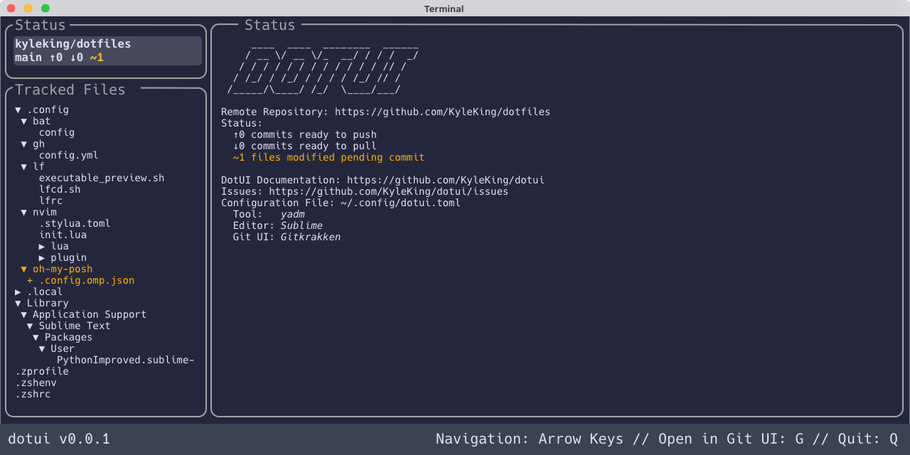
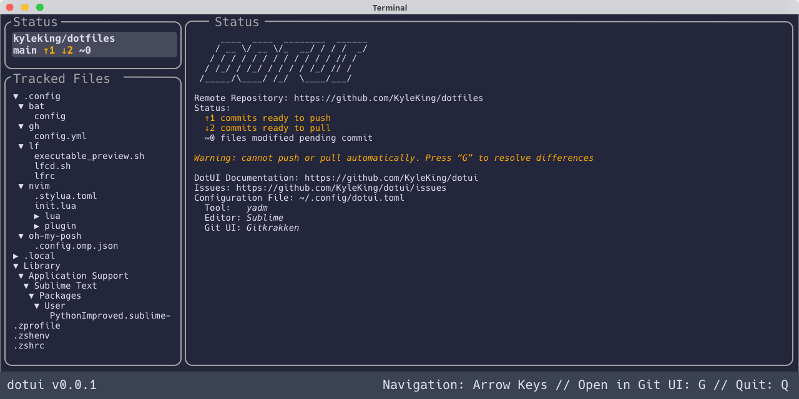
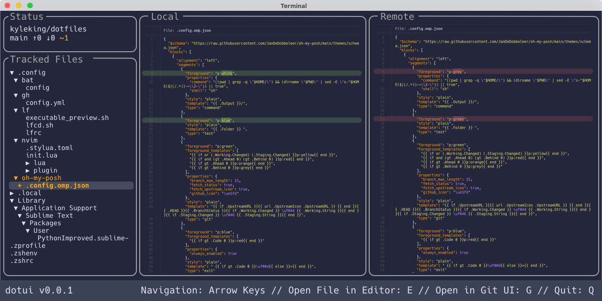
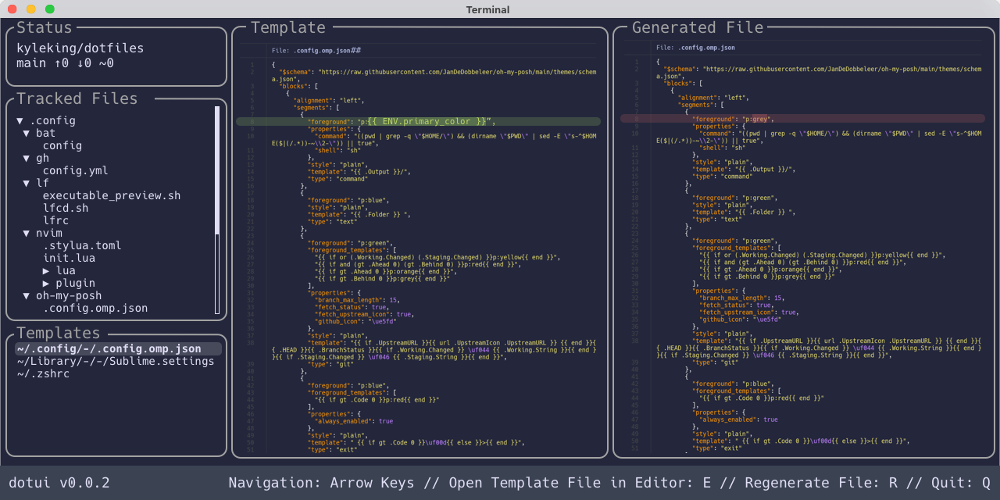

# Dotfile TUI (dotui)

> **Note**
>
> This repository captures the output from my [final project](https://omscs6750.gatech.edu/summer-2022/project) for the Summer 2022 semester of CS-6750 Human Computer Interactions.
> 
> The [final paper](./docs/adr/CS6750-Final-Project/HCI-Project-King.pdf), [survey data](./docs/adr/CS6750-Final-Project/Survey), and [thoughts on dotui implementation](./docs/adr) can all be found in this repository.
>
> `dotui` was a proposed terminal user interface (TUI) for managing dotfiles tracked in a bare git repo, such as with [`yadm`](https://github.com/TheLocehiliosan/yadm), but the design would have been pluggable in a way that could support most dotfile managers.
> 
> I still think this might be a good idea, but at least for now, I don't have the time to invest in building and maintaining the tool while working on a major project this Fall.
> 
> If you are interested in a tool like this, please feel free to open an Issue or Discussion!

## Alternatives

1. [For version control, `LazyGit` can work with bare git repositories](https://github.com/jesseduffield/lazygit/discussions/1201)
1. [To view all tracked files in an IDE, you can symlink `yadm`-managed files into a single directory](https://github.com/TheLocehiliosan/yadm/issues/153#issuecomment-487607398)
1. Or just keep using the `yadm-CLI` or switch to dotfile manager that has a central project already, [like Chezmoi, DotDrop, something built on Git Stow, etc.](https://dotfiles.github.io/utilities/)

## Mockups

A few mockups of what the application could look like:

And a v0.0.2 mockup where templates are added as a plugin:

